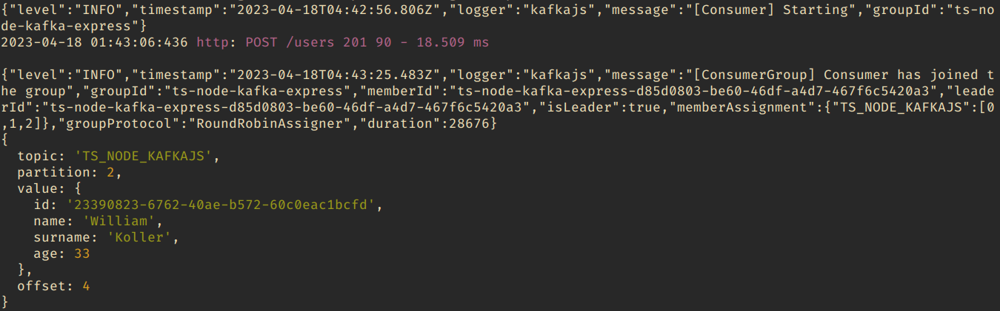

# TypeScript, Nodejs, Kafkajs and Express

## Techs

> Apache Kafka / KafkaJS

> Babel

> Docker

> Express

> Eslint

> TypeScript

> Pettier

> Nodemon

> Sucrase

> Zookeeper

- **Obs**:

  - **Sucrase is about 20x faster than Babel**. Here's one measurement of how Sucrase compares with other tools when compiling the Jest codebase 3 times, about 360k lines of code total:

```bash
            Time            Speed
Sucrase     0.57 seconds    636975 lines per second
swc         1.19 seconds    304526 lines per second
esbuild     1.45 seconds    248692 lines per second
TypeScript  8.98 seconds    40240 lines per second
Babel       9.18 seconds    39366 lines per second
```

- Example Consumer:


